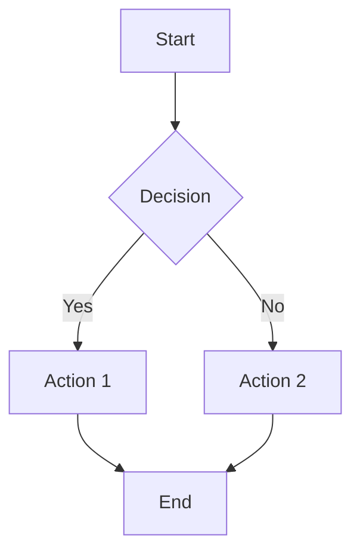
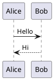
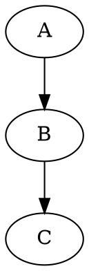

# CyberBlogX Ultimate Markdown Reference

> _Writing posts on CyberBlogX using Markdown + GitHub-Flavored extensions + inline HTML._

---

## Table of Contents

1. [Frontmatter & Metadata](#frontmatter--metadata)  
2. [Headings & Sections](#headings--sections)  
3. [Text Styling & Typography](#text-styling--typography)  
4. [Lists & Hierarchies](#lists--hierarchies)  
5. [Code & Syntax Highlighting](#code--syntax-highlighting)  
6. [Blockquotes, Admonitions & Callouts](#blockquotes-admonitions--callouts)  
7. [Horizontal Rules & Thematic Breaks](#horizontal-rules--thematic-breaks)  
8. [Links, Images & Media](#links-images--media)  
9. [Tables, Footnotes & Citations](#tables-footnotes--citations)  
10. [Definition Lists & Task Lists](#definition-lists--task-lists)  
11. [Math & Diagrams](#math--diagrams)  
12. [Embedding HTML & Iframes](#embedding-html--iframes)  
13. [Advanced Extensions (Mermaid, PlantUML)](#advanced-extensions-mermaid-plantuml)  
14. [Keyboard Shortcuts & Callouts](#keyboard-shortcuts--callouts)  
15. [Content Organization (TOC, Collapsible)](#content-organization-toc-collapsible)  
16. [Internationalization & RTL](#internationalization--rtl)  
17. [Release Notes & Changelogs](#release-notes--changelogs)  
18. [Conclusion & Next Steps](#conclusion--next-steps)

---

## Frontmatter & Metadata

```yaml
---
title: "Deep Dive into Markdown Magic"
subtitle: "Leveraging every feature on CyberBlogX"
date: 2025-05-30
author: "Your Name"
tags: [markdown, tutorial, archwiki, advanced]
categories:
  - Guides
  - Advanced
slug: deep-dive-markdown-magic
draft: false
toc: true       # automatically generate a Table of Contents
math: true      # enable KaTeX/math rendering
mermaid: true   # enable Mermaid diagrams
---
```

> **Usage:** Place at top of your `.md` file. CyberBlogX loader reads this to build metadata-driven pages.

---

## Headings & Sections

```markdown
# H1 – Page Title
## H2 – Major Section
### H3 – Subsection
#### H4 – Detail Section
##### H5 – Sub-detail
###### H6 – Minor Notes
```

> **Tip:** Use H2 for main sections, H3 for subsections. Don't skip levels.

---

## Text Styling & Typography

- **Bold**: `**bold**` → **bold**  
- _Italic_: `*italic*` → *italic*  
- ~~Strike~~: `~~strike~~` → ~~strike~~  
- __Underline__: `<u>underline</u>` → <u>underline</u>  
- `Monospace`: <kbd>`code`</kbd>  
- Superscript^: `x^2^` → x²  
- Subscript~: `H~2~O` → H₂O  

> Use HTML for underlines or custom tags.

---

## Lists & Hierarchies

### Unordered

```markdown
- Item A
  - Sub-item A1
    - Sub-sub-item A1a
- Item B
```

### Ordered

```markdown
1. First
2. Second
   1. Sub-second
   2. Sub-second
3. Third
```

### Task List

```markdown
- [x] Completed task
- [ ] Incomplete task
- [ ] Another task
```

---

## Code & Syntax Highlighting

### Fenced Code

```markdown
```js
// JavaScript example
function hello(name) {
  console.log(`Hello, ${name}!`);
}
```
```

### Inline Code

Use <code>`inline code`</code> within text.

### Indented Code

    def greet():
        print("Hello from Python")

---

## Blockquotes, Admonitions & Callouts

> Standard blockquote

<div class="admonition note">
**Note:** This is a custom “Note” admonition in HTML.
</div>

```markdown
> **Warning:** Watch your step!
> 
> Nested:
> > Danger ahead.
```

---

## Horizontal Rules & Thematic Breaks

```markdown
---

* * *

___
```

---

## Links, Images & Media

### Links

```markdown
[OpenAI](https://openai.com "OpenAI Homepage")
```

### Images

```markdown

```

### Image with HTML styling

```html

```

---

## Tables, Footnotes & Citations

### Tables

```markdown
| Feature       | Support | Notes                  |
|---------------|:-------:|------------------------|
| Bold          |   ✅    | **bold**               |
| Code blocks   |   ✅    | Syntax highlighting    |
| Tables        |   ✅    | GFM tables             |
| Footnotes     |   ✅    | See below              |
```

### Footnotes

```markdown
This is a statement.[^1]

[^1]: Here is the footnote explanation.
```

### Citations

```markdown
According to Smith et al. [^2], Markdown is powerful.

[^2]: Smith, J. (2024). *Markdown Mastery*. Publishing House.
```

---

## Definition Lists & Task Lists

### Definition List (HTML)

```html
<dl>
  <dt>Term One</dt>
  <dd>Definition for term one.</dd>
  <dt>Term Two</dt>
  <dd>Definition for term two.</dd>
</dl>
```

---

## Math & Diagrams

### KaTeX Math

Inline: `$E=mc^2$` → \(E=mc^2\)  
Block:

```markdown
$$
\int_{0}^{\infty} e^{-x^2} dx = \frac{\sqrt{\pi}}{2}
$$
```

### Mermaid Diagrams

```markdown

```

---

## Embedding HTML & Iframes

### YouTube Embed

```html
<iframe width="560" height="315"
  src="https://www.youtube.com/embed/dQw4w9WgXcQ"
  title="YouTube video player" frameborder="0" allowfullscreen>
</iframe>
```

### Google Maps

```html
<iframe src="https://www.google.com/maps/embed?..."></iframe>
```

---

## Advanced Extensions (PlantUML, Graphviz)

### PlantUML

```markdown

```

### Graphviz

```markdown

```

---

## Keyboard Shortcuts & Callouts

| Shortcut  | Action           |
|-----------|------------------|
| **Ctrl+S**| Save document    |
| **Ctrl+K**| Insert link      |
| **Ctrl+Shift+M** | Toggle preview |

> **Tip:** Use callouts to highlight shortcuts.

---

## Content Organization (TOC & Collapsible)

- **`toc: true`** in frontmatter auto-generates TOC.
- Collapsible sections:

<details>
<summary>Click to expand</summary>

```markdown
Hidden content goes here.
```

</details>

---

## Internationalization & RTL

```markdown
<div dir="rtl">
הזינו טקסט בעברית כאן
</div>
```

---

## Release Notes & Changelogs

### Unreleased

- 🔧 Refactored loader  
- 🐛 Fixed badge alignment  

### 1.0.0

- 🎉 Initial release  
- 📘 Added tutorial

---

## Conclusion & Next Steps

> You’ve just learned **every** Markdown trick possible on CyberBlogX:

- Metadata & frontmatter  
- Structured headings & TOC  
- Rich text styling  
- All list varieties  
- Code blocks & languages  
- Admonitions & callouts  
- Horizontal rules & theming  
- Links, images & embeds  
- Tables, footnotes & citations  
- Math, diagrams & flowcharts  
- HTML embeds & plugins  
- Internationalization  
- Release notes & changelogs  

Use this as your **master template**. Copy, modify, and create epic posts! 🚀✨  