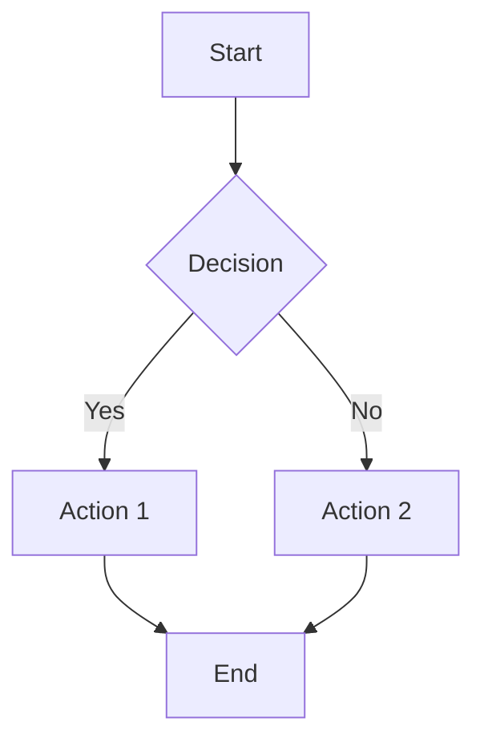
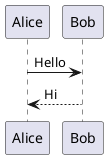
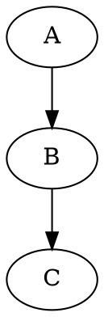

# CyberBlogX Ultimate Markdown Reference

> _Writing posts on CyberBlogX using Markdown + GitHub-Flavored extensions + inline HTML._

---

## Table of Contents

1. [Frontmatter & Metadata](#frontmatter--metadata)  
2. [Headings & Sections](#headings--sections)  
3. [Text Styling & Typography](#text-styling--typography)  
4. [Lists & Hierarchies](#lists--hierarchies)  
5. [Code & Syntax Highlighting](#code--syntax-highlighting)  
6. [Blockquotes, Admonitions & Callouts](#blockquotes-admonitions--callouts)  
7. [Horizontal Rules & Thematic Breaks](#horizontal-rules--thematic-breaks)  
8. [Links, Images & Media](#links-images--media)  
9. [Tables, Footnotes & Citations](#tables-footnotes--citations)  
10. [Definition Lists & Task Lists](#definition-lists--task-lists)  
11. [Math & Diagrams](#math--diagrams)  
12. [Embedding HTML & Iframes](#embedding-html--iframes)  
13. [Advanced Extensions (Mermaid, PlantUML)](#advanced-extensions-mermaid-plantuml)  
14. [Keyboard Shortcuts & Callouts](#keyboard-shortcuts--callouts)  
15. [Content Organization (TOC, Collapsible)](#content-organization-toc-collapsible)  
16. [Internationalization & RTL](#internationalization--rtl)  
17. [Release Notes & Changelogs](#release-notes--changelogs)  
18. [Conclusion & Next Steps](#conclusion--next-steps)

---

## Frontmatter & Metadata

```yaml
---
title: "Deep Dive into Markdown Magic"
subtitle: "Leveraging every feature on CyberBlogX"
date: 2025-05-30
author: "Your Name"
tags: [markdown, tutorial, archwiki, advanced]
categories:
  - Guides
  - Advanced
slug: deep-dive-markdown-magic
draft: false
toc: true       # automatically generate a Table of Contents
math: true      # enable KaTeX/math rendering
mermaid: true   # enable Mermaid diagrams
---
```

> **Usage:** Place at top of your `.md` file. CyberBlogX loader reads this to build metadata-driven pages.

---

## Headings & Sections

```markdown
# H1 – Page Title
## H2 – Major Section
### H3 – Subsection
#### H4 – Detail Section
##### H5 – Sub-detail
###### H6 – Minor Notes
```

> **Tip:** Use H2 for main sections, H3 for subsections. Don't skip levels.

---

## Text Styling & Typography

- **Bold**: `**bold**` → **bold**  
- _Italic_: `*italic*` → *italic*  
- ~~Strike~~: `~~strike~~` → ~~strike~~  
- __Underline__: `<u>underline</u>` → <u>underline</u>  
- `Monospace`: <kbd>`code`</kbd>  
- Superscript^: `x^2^` → x²  
- Subscript~: `H~2~O` → H₂O  

> Use HTML for underlines or custom tags.

---

## Lists & Hierarchies

### Unordered

```markdown
- Item A
  - Sub-item A1
    - Sub-sub-item A1a
- Item B
```

### Ordered

```markdown
1. First
2. Second
   1. Sub-second
   2. Sub-second
3. Third
```

### Task List

```markdown
- [x] Completed task
- [ ] Incomplete task
- [ ] Another task
```

---

## Code & Syntax Highlighting

### Fenced Code

```markdown
```js
// JavaScript example
function hello(name) {
  console.log(`Hello, ${name}!`);
}
```
```

### Inline Code

Use <code>`inline code`</code> within text.

### Indented Code

    def greet():
        print("Hello from Python")

---

## Blockquotes, Admonitions & Callouts

> Standard blockquote

<div class="admonition note">
**Note:** This is a custom “Note” admonition in HTML.
</div>

```markdown
> **Warning:** Watch your step!
> 
> Nested:
> > Danger ahead.
```

---

## Horizontal Rules & Thematic Breaks

```markdown
---

* * *

___
```

---

## Links, Images & Media

### Links

```markdown
[OpenAI](https://openai.com "OpenAI Homepage")
```

### Images

```markdown

```

### Image with HTML styling

```html

```

---

## Tables, Footnotes & Citations

### Tables

```markdown
| Feature       | Support | Notes                  |
|---------------|:-------:|------------------------|
| Bold          |   ✅    | **bold**               |
| Code blocks   |   ✅    | Syntax highlighting    |
| Tables        |   ✅    | GFM tables             |
| Footnotes     |   ✅    | See below              |
```

### Footnotes

```markdown
This is a statement.[^1]

[^1]: Here is the footnote explanation.
```

### Citations

```markdown
According to Smith et al. [^2], Markdown is powerful.

[^2]: Smith, J. (2024). *Markdown Mastery*. Publishing House.
```

---

## Definition Lists & Task Lists

### Definition List (HTML)

```html
<dl>
  <dt>Term One</dt>
  <dd>Definition for term one.</dd>
  <dt>Term Two</dt>
  <dd>Definition for term two.</dd>
</dl>
```

---

## Math & Diagrams

### KaTeX Math

Inline: `$E=mc^2$` → \(E=mc^2\)  
Block:

```markdown
$$
\int_{0}^{\infty} e^{-x^2} dx = \frac{\sqrt{\pi}}{2}
$$
```

### Mermaid Diagrams

```markdown

```

---

## Embedding HTML & Iframes

### YouTube Embed

```html
<iframe width="560" height="315"
  src="https://www.youtube.com/embed/dQw4w9WgXcQ"
  title="YouTube video player" frameborder="0" allowfullscreen>
</iframe>
```

### Google Maps

```html
<iframe src="https://www.google.com/maps/embed?..."></iframe>
```

---

## Advanced Extensions (PlantUML, Graphviz)

### PlantUML

```markdown

```

### Graphviz

```markdown

```

---

## Keyboard Shortcuts & Callouts

| Shortcut  | Action           |
|-----------|------------------|
| **Ctrl+S**| Save document    |
| **Ctrl+K**| Insert link      |
| **Ctrl+Shift+M** | Toggle preview |

> **Tip:** Use callouts to highlight shortcuts.

---

## Content Organization (TOC & Collapsible)

- **`toc: true`** in frontmatter auto-generates TOC.
- Collapsible sections:

<details>
<summary>Click to expand</summary>

```markdown
Hidden content goes here.
```

</details>

---

## Internationalization & RTL

```markdown
<div dir="rtl">
הזינו טקסט בעברית כאן
</div>
```

---

## Release Notes & Changelogs

### Unreleased

- 🔧 Refactored loader  
- 🐛 Fixed badge alignment  

### 1.0.0

- 🎉 Initial release  
- 📘 Added tutorial

---

## Conclusion & Next Steps

> You’ve just learned **every** Markdown trick possible on CyberBlogX:

- Metadata & frontmatter  
- Structured headings & TOC  
- Rich text styling  
- All list varieties  
- Code blocks & languages  
- Admonitions & callouts  
- Horizontal rules & theming  
- Links, images & embeds  
- Tables, footnotes & citations  
- Math, diagrams & flowcharts  
- HTML embeds & plugins  
- Internationalization  
- Release notes & changelogs  

Use this as your **master template**. Copy, modify, and create epic posts! 🚀✨  

.json example: 

{
  "title": "IRC Notifications to Mobile Device (HexChat)",
  "excerpt": "A step-by-step guide to receive IRC mentions on your mobile device using HexChat and Pushover.",
  "date": "2025-05-03",
  "read": 5,
  "tags": ["hexchat", "pushover", "irc", "notifications", "mobile"],
  "markdown": true,
  "video_url": "https://www.youtube.com/embed/dQw4w9WgXcQ?autoplay=1",
  "audio_url": "https://files.catbox.moe/gvp31e.flac"
}

.html example: 

```html
<!DOCTYPE html>
<html lang="en">
<head>
  <meta charset="UTF-8">
  <title>CyberBlogX~RK ./readme.md</title>
  <link
    href="https://fonts.googleapis.com/css2?family=Press+Start+2P&family=Roboto:wght@300;400;700&display=swap"
    rel="stylesheet"
  >
  <style>
    /* ========== ROOT & RESET ================================================= */
    *,*::before,*::after { box-sizing:border-box; margin:0; padding:0; }
    html,body { height:100%; width:100%; background:var(--bg-dark); color:var(--text);
      scroll-behavior:smooth; overflow-x:hidden; font-family:'Roboto',sans-serif; }
    :root {
      --neon: #0f0; /*! --neon-b: #39ff14; */
      --bg-dark: #000; --bg-light: #111; --text: #eee;
      --radius: 8px; --speed: .3s; --font-mono: 'Press Start 2P',cursive;
    }
    :root.light {
      --bg-dark: #fafafa; --bg-light: #fff; --text: #222;
      --neon: #05f; --neon-b: #0ff;
    }

    /* ========== UTILITIES ==================================================== */
    .container { max-width: var(--max,1200px); margin:0 auto; padding:1rem; }
    .flex { display:flex; align-items:center; }
    .just-between { justify-content:space-between; }
    .btn {
      display:inline-block; font-family:var(--font-mono); text-transform:uppercase;
      padding:.7rem 1.4rem; border:1px solid var(--neon); color:var(--neon);
      background:transparent; border-radius:var(--radius); letter-spacing:.05em;
      transition: background var(--speed), color var(--speed), box-shadow var(--speed);
      margin-left:1rem;
    }
    .btn:hover {
      background:var(--neon); color:var(--bg-dark);
      box-shadow:0 0 8px var(--neon),0 0 16px var(--neon-b);
    }
    .btn.neon-flicker {
      animation: flicker 1.5s infinite;
    }
    @keyframes flicker {
      0%,18%,22%,25%,53%,57%,100% { opacity:1; }
      20%,24%,55% { opacity:.4; }
    }

    /* ========== HEADER ======================================================= */
    header {
      position:fixed; top:0; left:0; width:100%;
      background:rgba(0,0,0,.8); backdrop-filter:blur(6px); z-index:100;
    }
    .navbar { max-width:var(--max,1200px); margin:0 auto; padding:1rem; }
    .logo a {
      font-family:var(--font-mono); font-size:1.5rem; color:var(--neon);
      text-decoration:none; text-shadow:0 0 4px var(--neon);
    }
    .nav-links { list-style:none; display:flex; align-items:center; gap:1rem; }
    .nav-links li { display:block; }
    .nav-links a, .nav-links button {
      color:var(--neon); text-decoration:none; position:relative;
      background:none; border:none; cursor:pointer; font-family:var(--font-mono);
    }
    .nav-links a::after, .nav-links button::after {
      content:''; position:absolute; bottom:-4px; left:0; width:0; height:2px;
      background:var(--neon-b); transition:width var(--speed);
    }
    .nav-links a:hover::after, .nav-links button:hover::after {
      width:100%;
    }
    /* == Light-bulb & envelope hover just like “Messages” underlines + flicker == */
    #theme-btn {
      /* make sure it’s positioned for its own underline */
      position:relative;
    }
    #theme-btn:hover {
      /* cancel the btn:hover background/glow */
      background:transparent !important;
      color:var(--neon) !important;
      box-shadow:none !important;
      animation:flicker 1.5s infinite;
    }
    #theme-btn::after {
      content:'';
      position:absolute; bottom:-4px; left:0;
      width:0; height:2px;
      background:var(--neon-b);
      transition:width var(--speed);
    }
    #theme-btn:hover::after {
      width:100%;
    }
    /* envelope link (📧) already underlines on hover via .nav-links a:hover::after */

    .nav-toggle { display:none; background:none; border:none; cursor:pointer; }
    .hamburger, .hamburger::before, .hamburger::after {
      width:28px; height:3px; background:var(--neon);
      display:block; position:relative; transition:all var(--speed);
    }
    .hamburger::before, .hamburger::after { content:''; position:absolute; left:0; }
    .hamburger::before { top:-8px; } .hamburger::after { top:8px; }
    .hamburger.open { transform:rotate(45deg); }
    .hamburger.open::before { top:0; transform:rotate(90deg); }
    .hamburger.open::after { top:0; opacity:0; }

    /* ==== PROGRESS BAR UNDER HEADER ==== */
    #progress-container {
      position:absolute; bottom:0; left:0; width:100%; height:4px;
      background:var(--bg-light);
    }
    #progress-bar {
      width:0%; height:100%; background:var(--neon);
    }

    @media(max-width:768px){
      .nav-toggle { display:block; }
      .nav-links {
        display:none; flex-direction:column; position:fixed; top:60px; right:0;
        width:200px; height:calc(100% - 60px); background:var(--bg-light);
        padding:2rem;
      }
      .nav-links.show { display:flex; }
      .nav-links li { margin:1rem 0; }
    }

    /* ========== POST LAYOUT ================================================== */
    .post-content {
      max-width:800px; margin:100px auto 2rem auto; line-height:1.6; padding:0 1rem;
    }
    .post-content h2, .post-content h3, .post-content h4 { margin-top:2rem; }
    h1 {
      font-family:var(--font-mono); color:var(--neon-b); margin-bottom:1rem;
    }

    /* ========== BACK TO TOP ================================================== */
    #top {
      position:fixed; right:1rem; bottom:1rem; width:48px; height:48px;
      background:var(--neon-b); border-radius:50%; display:flex;
      align-items:center; justify-content:center; cursor:pointer;
      opacity:0; visibility:hidden; transition:opacity var(--speed),visibility var(--speed);
      z-index:1000;
    }
    #top.visible { opacity:1; visibility:visible; }
    #top svg { width:24px; height:24px; fill:var(--bg-dark); }
  </style>

  <!-- Marked.js for Markdown rendering + header-ID support -->
  <script src="https://cdn.jsdelivr.net/npm/marked/marked.min.js"></script>
  <script>
    marked.setOptions({
      gfm: true,
      headerIds: true,
      headerPrefix: '',
      mangle: false
    });
  </script>
</head>
<body>
  <!-- HEADER -->
  <header>
    <nav class="navbar flex just-between">
      <div class="logo"><a href="/feed/blog">CyberBlogX~RK</a></div>
      <ul class="nav-links">
        <li><a href="/layer/redacted.html">index</a></li>
        <li>
          <button id="audio-toggle" class="btn neon-flicker" title="Unmute Music">
            🔈 Unmute
          </button>
        </li>
        <li>
          <button id="audio-playpause" class="btn neon-flicker" title="Pause Music">
            ⏸ Pause
          </button>
        </li>
        <li>
          <button id="theme-btn" class="btn" title="Toggle Light/Dark">
            💡
          </button>
        </li>
        <li><a href="mailto:contact@rkeaves.online">🏠</a></li>  
        <li><a href="mailto:contact@rkeaves.online">📧</a></li>
      </ul>
      <button class="nav-toggle" aria-label="Toggle navigation">
        <span class="hamburger"></span>
      </button>
    </nav>
    <div id="progress-container"><div id="progress-bar"></div></div>
  </header>

  <!-- MAIN CONTENT -->
  <article class="post-content container">
    <h1 id="title">Loading…</h1>
    <div id="body">Please wait.</div>

    <!-- Video (paused) -->
    <section id="video-section" style="display:none; margin-top:2rem;">
      <h2>Featured Video</h2>
      <iframe
        id="video-frame" width="560" height="315"
        src="" title="YouTube video player" frameborder="0"
        allow="encrypted-media; fullscreen" allowfullscreen>
      </iframe>
    </section>

    <!-- Audio (autoplay, muted) -->
    <section id="audio-section" style="display:none; margin-top:2rem;">
      <h2>Background Audio</h2>
      <audio
        id="audio-player" controls autoplay loop muted
        style="width:100%; margin-top:.5rem;">
        <source src="" type="audio/flac">
        Your browser does not support the HTML5 Audio element.
      </audio>
    </section>
  </article>

  <!-- BACK TO TOP -->
  <div id="top" title="Back to top">
    <svg viewBox="0 0 24 24"><path d="M12 4l-8 8h16z"/></svg>
  </div>

  <script>
    // THEME TOGGLE
    const root = document.documentElement;
    let theme = localStorage.getItem('theme') || 'dark';
    const applyTheme = () => {
      root.classList.toggle('light', theme==='light');
      localStorage.setItem('theme', theme);
    };
    applyTheme();
    document.getElementById('theme-btn').addEventListener('click', e=>{
      e.preventDefault();
      theme = theme==='dark'?'light':'dark';
      applyTheme();
    });

    // MOBILE NAV
    document.querySelector('.nav-toggle').addEventListener('click', () => {
      document.querySelector('.nav-links').classList.toggle('show');
      document.querySelector('.hamburger').classList.toggle('open');
    });

    // BACK TO TOP
    const topBtn = document.getElementById('top');
    window.addEventListener('scroll',()=>{
      topBtn.classList.toggle('visible', window.scrollY>300);
    });
    topBtn.addEventListener('click',()=>window.scrollTo({top:0,behavior:'smooth'}));

    // AUDIO CONTROLS & PROGRESS
    const audio = document.getElementById('audio-player'),
          toggleBtn = document.getElementById('audio-toggle'),
          pauseBtn  = document.getElementById('audio-playpause');

    toggleBtn.addEventListener('click',()=>{
      audio.muted=!audio.muted;
      toggleBtn.innerHTML = audio.muted?'🔈 Unmute':'🔊 Mute';
      toggleBtn.classList.remove('neon-flicker');
      void toggleBtn.offsetWidth;
      toggleBtn.classList.add('neon-flicker');
    });
    pauseBtn.addEventListener('click',()=>{
      if(audio.paused){ audio.play(); pauseBtn.innerHTML='⏸ Pause'; }
      else { audio.pause(); pauseBtn.innerHTML='▶️ Play'; }
      pauseBtn.classList.remove('neon-flicker');
      void pauseBtn.offsetWidth;
      pauseBtn.classList.add('neon-flicker');
    });
    audio.addEventListener('timeupdate',()=>{
      if(audio.duration){
        document.getElementById('progress-bar').style.width =
          (audio.currentTime/audio.duration*100)+'%';
      }
    });

    // LOAD POST + Markdown + Media
    const m = window.location.pathname.match(/\/posts\/feed\/(\d+)\/\1\.html$/);
    if(!m) {
      document.getElementById('body').textContent='Invalid post URL';
    } else {
      const id=m[1];
      fetch(`./${id}.json`)
        .then(r=>r.ok?r.json():Promise.reject())
        .then(j=>{
          document.getElementById('title').textContent=j.title;
          if(j.markdown){
            fetch(`./${id}.md`)
              .then(r=>r.ok?r.text():Promise.reject())
              .then(md=>document.getElementById('body').innerHTML=marked.parse(md))
              .catch(()=>document.getElementById('body').textContent='Content not found.');
          } else {
            document.getElementById('body').innerHTML=j.content||'';
          }
          if(j.video_url){
            document.getElementById('video-frame').src=j.video_url;
            document.getElementById('video-section').style.display='block';
          }
          if(j.audio_url){
            document.getElementById('audio-section').style.display='block';
            audio.src=j.audio_url;
            audio.play().catch(()=>{/* gesture required */});
          }
        })
        .catch(()=>document.getElementById('body').textContent='Post not found.');
    }
  </script>
</body>
</html>
```